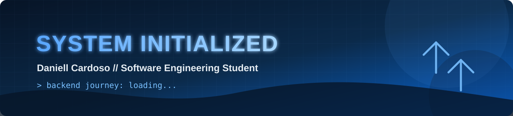

  

 

`> Status: aprendendo, construindo e evoluindo`

---

## 🎓 Sobre mim

Olá! Eu sou **Daniell Cardoso**, estudante de Engenharia de Software na **PUC Minas**, em Belo Horizonte.

Estou direcionando meus estudos para o desenvolvimento **back-end**, especialmente com **Java, Spring Boot, APIs REST e bancos de dados**. Desenvolvo projetos acadêmicos e pessoais para fortalecer lógica de programação, orientação a objetos, construção de APIs e versionamento com Git e GitHub.

Também participo de uma **Empresa Júnior de Engenharia de Software**, onde tenho contato com projetos, trabalho em equipe e soluções tecnológicas para problemas reais.

- 🔭 Construindo projetos para transformar teoria em prática
- 🌱 Estudando Java, Spring Boot, APIs REST e back-end
- 🎯 Buscando oportunidades de estágio e desenvolvimento júnior
- 🌎 Objetivo de atuar no Brasil e, futuramente, em projetos internacionais
- 💬 Podemos conversar sobre Java, desenvolvimento web, APIs e Git

---

## 💡 Interesses pessoais

- 🏃 Corrida e evolução constante
- ✈️ Viagens, natureza e novas experiências
- 🎮 Jogos e tecnologia
- ⚽ Futebol e esportes
- 🤝 Projetos colaborativos e empreendedorismo
- 🚀 Aprender algo novo todos os dias

---

## </> Tech stack

### Foco atual

`Java` • `Spring Boot` • `APIs REST` • `SQL`

### Outras tecnologias

`Python` • `JavaScript` • `HTML` • `CSS` • `Bootstrap`

---

## 🛠️ Ferramentas

`Git` • `GitHub` • `VS Code` • `IntelliJ IDEA`

---

## 🚀 Projetos em destaque

<table>
  <tr>
    <td width="50%" valign="top">
      <h3>🎬 CineVerse</h3>
      
Catálogo de filmes responsivo desenvolvido com HTML, CSS, Bootstrap e JavaScript, com busca, filtros e integração de dados.

      <a href="https://github.com/daniell-2508/CineVerse">Ver projeto →</a>
    </td>
    <td width="50%" valign="top">
      <h3>🏓 PyPong</h3>
      
Versão do clássico Pong criada em Python com Pygame, aplicando lógica, colisões, pontuação e trabalho em equipe.

      <a href="https://github.com/daniell-2508/projeto_pygame">Ver projeto →</a>
    </td>
  </tr>
</table>

---

## 📊 Status do sistema

  
  

  

> As linguagens exibidas são calculadas a partir dos repositórios públicos e não representam necessariamente meu nível de domínio.

---

## 👾 Contribution grid

  <picture>
    <source media="(prefers-color-scheme: dark)" srcset="https://raw.githubusercontent.com/daniell-2508/daniell-2508/output/pacman-contribution-graph-dark.svg">
    <source media="(prefers-color-scheme: light)" srcset="https://raw.githubusercontent.com/daniell-2508/daniell-2508/output/pacman-contribution-graph.svg">
    
  </picture>

---

## 📱 Canais de contato

   
  <strong>Obrigado por visitar meu perfil!</strong> 
  Aberto a conexões, aprendizado e novas oportunidades.

